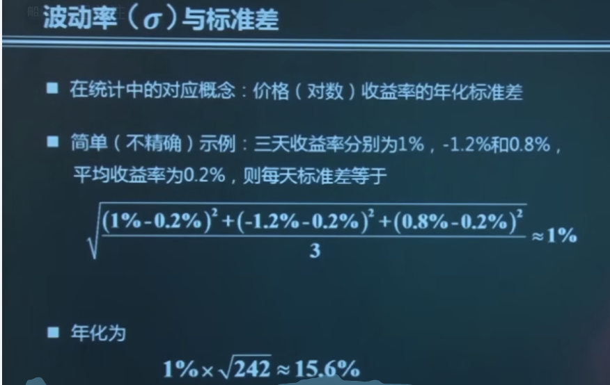
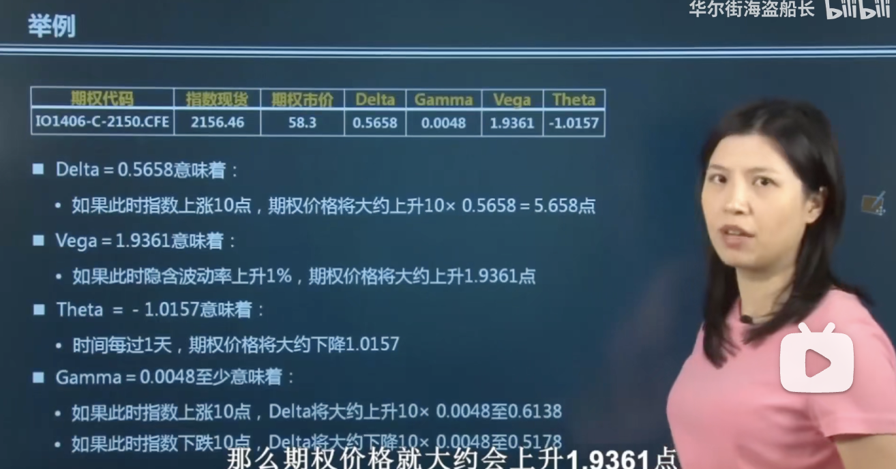

## 0.交易期权是在交易什么

- 交易期权就是在交易波动率
- 希腊字母是刻画期权头寸的另一种方式

## 1.波动率

### 1.1基本含义

没有波动，期权就没用存在的价值。

波动率的计算方式，是使用数学中的标准差来计算的。下面举例来进行计算

### 1.2波动率分类

现在市场上常用的是**已实现波动率**，计算方法就是高频的抓取数据计算方差，然后再计算年化来当做波动率。 

### 1.3隐含波动率

隐含波动率和期权价格是一一对应的，所以知道了期权的隐含波动率，我们就知道了期权的价格。

特征

- 不同的行权价，不同的期限，其隐含波动率是不一样的。

## 希腊字母概述

- 比较静态的敏感分析

- 其他条件不变某因素变化1单位，期权价格大约变化多少？

  | 希腊字母  |                             含义                             |
  | :-------: | :----------------------------------------------------------: |
  |   Delta   |               标的资产价格；相当于物理中的速度               |
  | **T**heta |                             时间                             |
  | **V**ega  |                    隐含波动率(volatility)                    |
  |  **R**ho  |                        利率(**R**ate)                        |
  |   Gamma   | 标的资产价格变动1单位，Delta大约变多少；相当于物理中的加速度 |

  举例说明

  

## Delta的基本含义

- 标的资产价格变动1单位，从切线上看，期权的价格变多少
- 期权价格曲线切线斜率（动态时变）delta=斜率
- delta=（期权价格/现货价格 ）一阶导

### Delta的基本特征

特征1

delta的取值范围

1. 欧式看涨期权多头dealt的取值范围为:0<delta<1
2. 欧式看跌期权多头delta的取值范围为:-1<delta<0

看涨多头的delta值的含义

| delta值范围 |   含义   |
| :---------: | :------: |
|   (0,0.5)   | 虚值看涨 |
|     0.5     | 平价期权 |
|  （0.5,1）  | 实值期权 |

看跌多头delta的含义

| delta值范围  |   含义   |
| :----------: | :------: |
| （-1，-0.5） | 实值看跌 |
|     -0.5     | 平价看跌 |
|  （-0.5,0）  | 虚值看跌 |

总结经验

> 1. 只要是趋近于0的，都是趋近于虚值的。
> 2. 看涨和看涨期权的delta符号是相反的。

2.特征2

- 快到期时，实值、虚值和平价期权的delta差异较大。(所以如果你买的期权经过一段时间以后，恰恰是实值期权，那么你期权会比较值钱，相反虚值期权会变的一文不值)

3.特征3

波动率较低时，实值、虚值和平价期权的delta差异较大。

delta的例子

|       头寸       |  delta   |                          例子                          |
| :--------------: | :------: | :----------------------------------------------------: |
|     现货多头     |    1     |          4单位多头，价格每变化一单位：4x1x1=4          |
|     现货空头     |    -1    |                                                        |
|     期货多头     |    1     |                                                        |
|     期货空头     |    -1    |                                                        |
| 欧式看涨期权多头 | （0,1）  | 4单位的多头，每单位delta为0.5：4x1x0.5=2;期权价值变化2 |
|   欧式看涨空头   | （-1,0） |                                                        |
|   欧式看跌多头   | （-1,0） |                                                        |
|   欧式看跌空头   | （0,1）  |                                                        |

delta中性

- delta中性意味着投资组合对现货价格变动的一阶敏感性为0
- delta中性实现：运用同一标的资产的现货、期权和期货等进行相互套利保值，使证券组合的值等于0。
- delta中性的特点：有期权的情况下是动态的，需要不断调整头寸以使组合重新出于delta中性状态，这种调整称为再平衡(rebalance)。

> delta中性有个特点就是让自己的资产不发生变化，从而达到保值的目的。

## Gamma的含义

1. 标的资产价格变动1单位，期权delta变多少

2. 知道gamma的值就能很快的推算出来delta的值

3. gamma相当于加速度，gamma越大，相当于delata变化越剧烈，从而期权的价格变化也越剧烈。

4. gamma是期权价格曲线曲度的主要部分（其实就是反应了期权价格曲线的弯曲程度）

5. delta考虑的是直线上的影响，而真实的期权价格=deltax资产标的价格变化+(1/2)xgammax 价格变化的平方

   > 比如资产价格上升了1块钱,delta=0.5,gamma=0.1那么期权的价格变化为:
   >
   > 0.5x1+(1/2)x0.1x1=0.55
   >
   > > 如果gamma的值比较大的话，那么call的期权涨的时候涨的更猛，跌的时候跌的更少。

## Gamma的基本特性

- 只要是期权的多头 Gamma>0, 期权的空头 Gamma<0 。这里需要注意的是多头和空头符号是不同的，而不是根据call和put来判断。
- 其他条件相同的欧式期权：看涨Gamma=看跌Gamma 。
- 平价附近期权的Gamma值较大。
- 快到期时，实值、虚值、平价期权的Gamma差异较大。
- 波动率较低时，实值、虚值和平价期权的Gamma差异较大。

## Gamma中性

- 只有期权有Gamma值
- 证券组合Gamma值为0时称为Gamma中性
- $\Gamma$ 中性是为了消除$\Delta$ 中性的误差，同样也是动态概念。
- 由于保持$\Gamma$ 中性只能通过期权头寸的调整获得，实现$\Gamma$ 中性的结果往往是$\Delta$ 非中性，因而常常还需要运用标的资产或者期权头寸进行调整，才能使得证券组合同时实现$\Delta$ 中性和$\Gamma$ 中性。
- $\Delta$中性和$\Gamma$ 同时保持中性，才能保证整个投资组合无论市场怎么变化，都能保持资产价值不变。

## Theta的含义

- 时间推移1单位（常为1天），期权价格变多少？
- $\Delta$ = $\frac{\delta c}{\delta t}$ ；期权价格和时间的求导。

## Theta的特征   

- 期权的$\Theta$ 通常为负：一般来说，随着到期日的临近，期权的价格逐渐衰退(time decay).
- 大部分都是随着时间的流逝，你的权利在变小，只有很少的情况下，你的权益是随着时间而增加的，那么Theta的值才是正的。
- 剩余时间越短，time decay速度越快，Theta负的越多。
- 与实值、虚值期权相比，平价期权的Theta值负值最大。
- 快到期时，实值、虚值和平价期权的theta值差异较大。

## Theta与套期保值

- 时间的推移是确定的，没有风险可言。因此无需"Theta中性"。
- Theta值的大小反映了期权购买者随着时间推移损失的价值，因而Theta值仍是一个重要的敏感性指标。

## Vega的含义

- 隐含波动率每变动一单位，期权价格变多少？

## Vega的特征

- Vega >0; 当波动率变大的时候，期权的价格会越贵。
- （欧式）看涨期权Vega=看跌期权Vega
- 平价期权的Vega值较大
- 剩余期限越长，Vega值越大。

> Vega值越大，代表的是投资者面对波动率变化的风险越大。

Vega实际运用场景

> 如果某期权的Vega为0.15，若价格波动率上升（下降）1%，期权的价值将上升（下降）0.15。若[期货价格](https://baike.baidu.com/item/期货价格?fromModule=lemma_inlink)[波动率](https://baike.baidu.com/item/波动率?fromModule=lemma_inlink)为20%，[期权理论](https://baike.baidu.com/item/期权理论/7341155?fromModule=lemma_inlink)价值为3.25，当波动率上升为22%，期权理论价值为 3.55（3.25+2×0.15）；当波动率下为18%，期权理论价值为2.95（3.25-2×0.15）。当价格波动率增加或减少时，期权的价值都会增加或减少因此，[看涨期权](https://baike.baidu.com/item/看涨期权/263237?fromModule=lemma_inlink)与[看跌期权](https://baike.baidu.com/item/看跌期权/263423?fromModule=lemma_inlink)的Vega都是正数。期权[多头部位](https://baike.baidu.com/item/多头部位/10527424?fromModule=lemma_inlink)的Vega都是正数, 期权空头的Vega都是负数。
>
> > 站在买方的角度来看，long call或者long put 情况下vega都是正数；
> >
> > 站在卖方的角度来看，short call或者 short put 情况下 vega都是负数

当vega值比较大的时候，如果发生比较大的波动率，那么收益或者损失也是会加大的。
