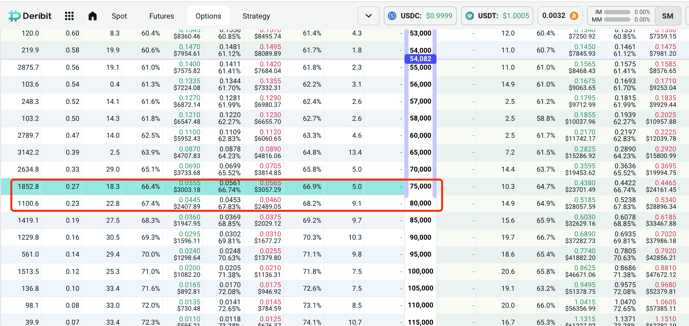
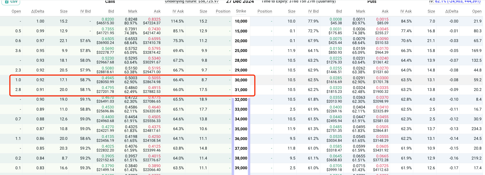

---
title: "关于当前对比特币一些思考"
subtitle: "比特币"
layout: post
author: "bulingfeng"
header-style: text
tags:
- 投资
- 区块链

今天突然明白或者说更深刻的明白了段总（段永平）为何只卖期权，而不买期权了。因为在他看来买期权就是在赌博。而卖期权呢，只要你守好不爆仓的原则，反过来你知道你需要的是什么。是实实在在的股票标的（sell put），还是到某个心理价位之后出售自己的标的(sell call)。这个方式虽然赚钱很慢，但是会让你心理特别的淡定，你无需再频繁的进行操作和盯盘。

而且卖期权有个特别牛逼的地方！

> **即使你判断错了方向，你也不会亏大钱！！！** 前提是你知道你想做什么的时候！这个个买方就是天然之别。期权的买方由于需要找到合适的时间点，所以一旦你操作错方向或者时间不对，你可能会把裤衩子都亏光。
>
> **而对于卖方来说，一切变的简单了起来。**因为时间对你来说对你影响微乎其微。

而且卖方也能获取到不错的收益，比如一年10%~20%左右的利润。最关键的是你不会亏钱，当然这个亏钱指的是长期来看，比如你sell call，如果标的发生大幅度的暴跌，那么从法币的角度来看，你还是会发生比较大的亏损的。

既然有了这个原则，那么自己的方向就很明确了。自己只需要多赚钱然后收集筹码即可。然后把相对应的部分筹码，比如30%的筹码来进行做sell，因为区块链交易所不知道什么时候就会发生跑路或者说被盗币等等之类的。

而且卖call不一定是收益很低的事情，有时候3个月的利息就可能达到10%左右。比如当前的btc价格情况下：

> 2024-02-15 btc的价格为52000美金一枚。比如拿2024-06-28的80000美金的call来说，当前的call的价值为：3731美金。
>
> 也就是说btc如果在未来的3个月(准确的说是2个半月)能够涨40%以及以上，那么自己就按照70000美金的价格卖给对方。
>
> 对自己来说，自己btc的价格是20000美金购买的，如果能够以70000美金进行售出，这样的也是极其美好的，而且别忘了自己还能收获3731美金的权利金。也就是说自己是按照73731美金进行售出的每个比特币。
>
> 单单是权利金收益利率大约是:7.17%的利率。 当然derbit计算都是按照btc来进行计价的。如果btc价格暴跌很多，这个收益也会同比下降。

所以卖call的时候要注意一下的几点：

> 1. 如果你认为未来是会大涨的行情，那么你就卖一些虚值的期权，并且这个期权的价格和时间你要想好，如果万一进行行权，这个价格你要能够接受。
> 2. **如果你是看涨未来标的话，sell call的时间不要太长，太长你的可控制的变量会很少。比如你在16000的时候进行了sell call，如果你设置的是一年后的45000，那么也极有可能被行权。而且45000对区块链世界来说这个收益不是很高的。你认为后市会涨的话，一般推荐使用三个月为期限。而且如果价格太低的话，建议进行卖少量的call。比如卖出10%-20%的仓位的call，万一后市进行暴涨，你可以有筹码再进行卖call。**
> 3. 如果你感觉未来币价会暴跌，那么你可以sell 实值的期权。**注意如果你认为一个标的已经到了相对的高点，那么你进行要进行出售你想的合理仓位的现货，然后使用剩下的现货中你可以接受的比例来进行sell call。**
>
> **关于实值的期权的售卖，下面进行比较详细的介绍。**

上面的图片是2024-12-27时候的期权截图。也就是10个月后的期权。可以看到即使是35000美金的btc的call也价值**24221美金呢**！

也就是说如果在一年之后，只要btc价格跌破35000美金，也就是说暴跌30%以上，那么你就能得到**24221美金的比特币**。如果是在牛顶的时候采用这个方式，无疑是收获巨大的。而且从概率上来看也是很大概率的。

比如在上一轮的牛市中，最高价格为69000美金的，如果你卖出一年后35000美金，能让收获不少现金。而且会比24221美金更多。并且实际效果就是1年之后btc的价格实际上跌到16000美金左右。**而且你还可以在盈利不错的情况下，结束你深度sell call**，然后再继续sell call（虚值的）。

> 从这个角度来看，当btc发生暴跌的时候，自己其实不需要做太多的动作。自己只需要买更多的币，然后再进行sell操作即可。

而sell put，其实是可以帮助自己收集筹码，比如自己现金超级多。那么就可以进行sell put来进行收集一些筹码。
